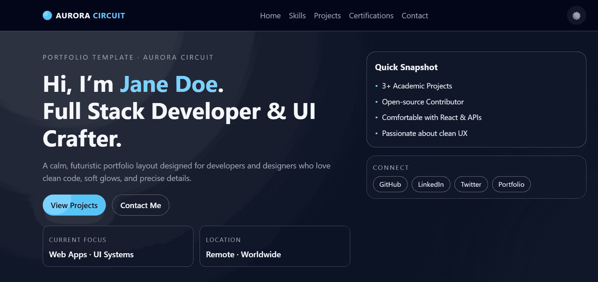
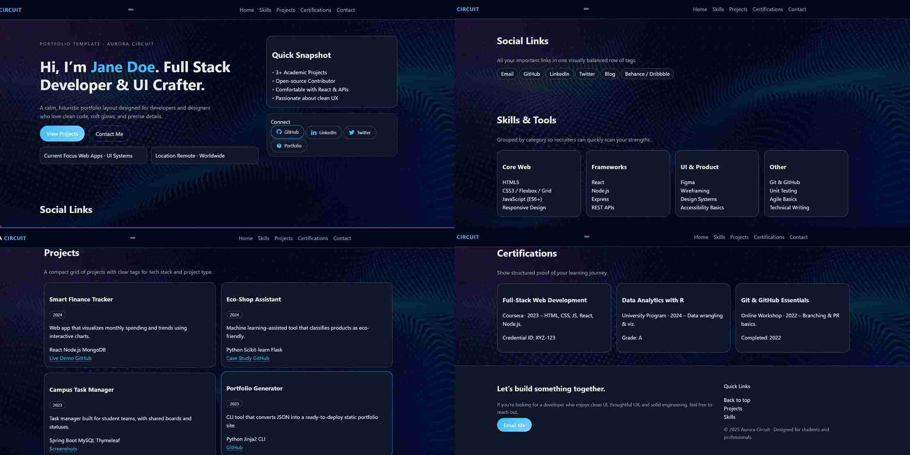
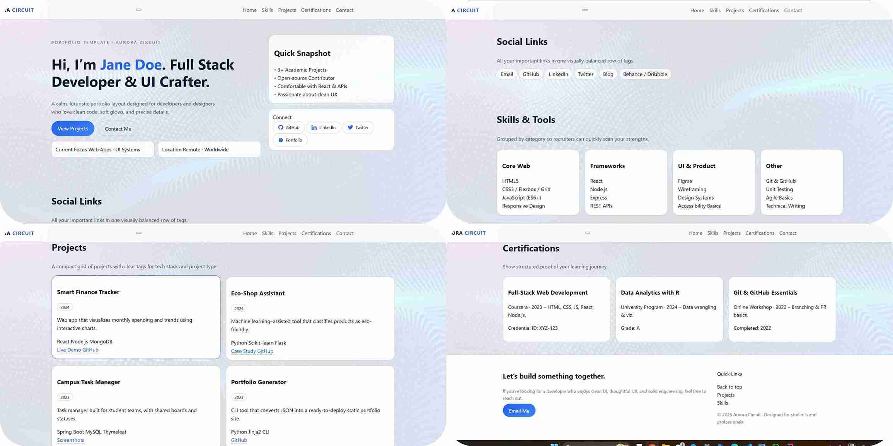
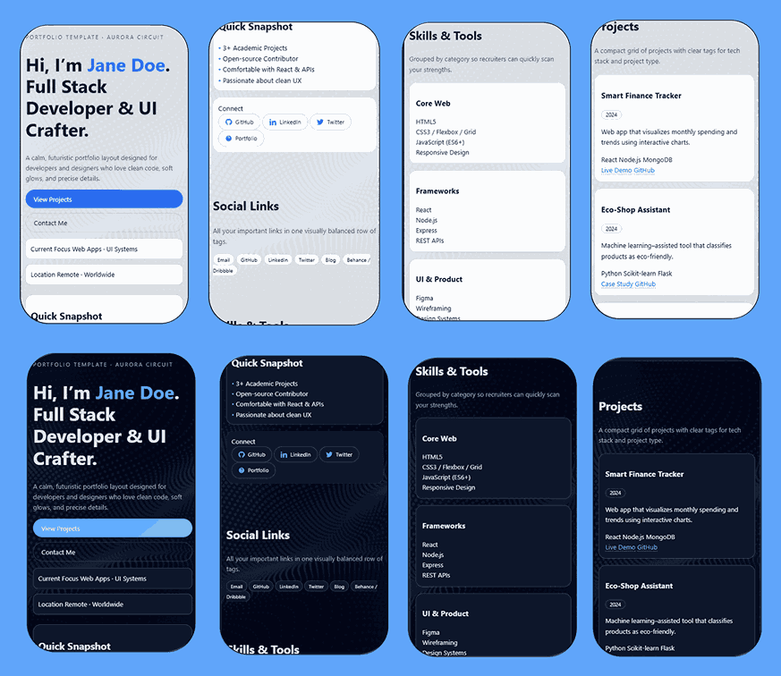

# Aurora Circuit – Calm Futuristic Portfolio Template

Aurora Circuit is a **modern, fully responsive portfolio template** for developers and designers who love a calm yet futuristic feel.

It blends soft glows, rounded cards, and subtle circuit-like borders to create a professional layout that still feels friendly and approachable.

---

## 🌌 Theme Concept & Brand Story

> **Tagline:** “Quietly futuristic. Designed for clarity.”

Aurora Circuit imagines your portfolio as the **control board of a starship** – precise, illuminated, and carefully organized.  
Instead of loud neon or harsh contrasts, it uses **soft blues and cyans**, accented by a warm orange pulse, to guide attention gently.

The design emphasizes:

- Clear information hierarchy
- Readable typography
- Gentle gradients and glows
- A balanced, grid-based layout

Perfect for:

- Students preparing for placements
- Fresh graduates entering tech roles
- Developers & designers who want a template they can easily customize

---

## Preview









---

## 🎨 Color Palette

Light theme:

- `--color-bg`: `#f4f5fb` – Soft mist background
- `--color-surface`: `#ffffff` – Card surfaces
- `--color-surface-alt`: `#eef1fb` – Section strips
- `--color-text`: `#0f172a` – Main text
- `--color-muted`: `#6b7280` – Muted text
- `--color-primary`: `#2563eb` – Electric blue highlight
- `--color-primary-soft`: `#93c5fd` – Soft glow blue
- `--color-accent`: `#f97316` – Warm accent orange
- `--color-footer-bg`: `#0f172a` – Deep ink footer

Dark theme:

- `--color-bg`: `#020617` – Starlit background
- `--color-surface`: `#020817` – Panel surfaces
- `--color-text`: `#e5e7eb` – Main text
- `--color-muted`: `#9ca3af` – Muted grey
- `--color-primary`: `#38bdf8` – Cyan accent
- `--color-primary-soft`: `#7dd3fc` – Soft cyan glow

> Both themes share the same layout but swap colors via CSS variables.

---

## 🔤 Typography

- **Base font:** System UI stack  
  `system-ui, -apple-system, BlinkMacSystemFont, "Segoe UI", Roboto, "Helvetica Neue", Arial, sans-serif`
- **Style:**
  - Medium letter-spacing in headings
  - Rounded corners + pill-shaped tags
  - Clear section titles and subtitles

You can easily change the font globally by editing `--font-sans` in `css/variables.css`.

---

## ✨ Features

- ✅ Fully responsive (desktop, tablet, mobile)
- ✅ Sticky navigation bar with blur effect
- ✅ Hero section with:
  - Gradient + optional background image overlay (`sample-image.jpg`)
  - Quick “snapshot” card
  - Social connection links
- ✅ Social links tags row
- ✅ Skills section in category cards
- ✅ Projects grid with year tags and tech stack pills
- ✅ Certifications section (optional, easy to remove)
- ✅ Footer with contact CTA and useful shortcuts
- ✅ Accessible color contrast and readable font sizes
- ✅ **Dark mode toggle** (remembers your choice using `localStorage`)
- ✅ **Mobile menu toggle** (hamburger menu)
- ✅ **Smooth scrolling** for internal navigation

---

## 📂 File Structure

```text
Aurora_Circuit
  /css
    index.css            # light theme colors
    index-dark.css       # dark theme colors
    main-styles.css      # layout, sections, components
    responsive-styles.css# media queries
    variables.css        # spacing, fonts, shadows
  /images
    sample-image.jpg     # subtle hero background
  /site-previews
    desktop_website.png  # screenshot (add later)
    mobile_website.png
    website_1.png
  index.html             # main template file
  README.md              # documentation
```